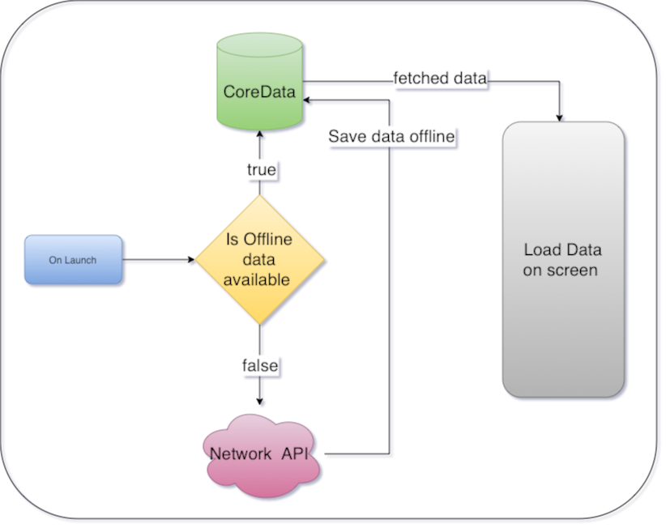
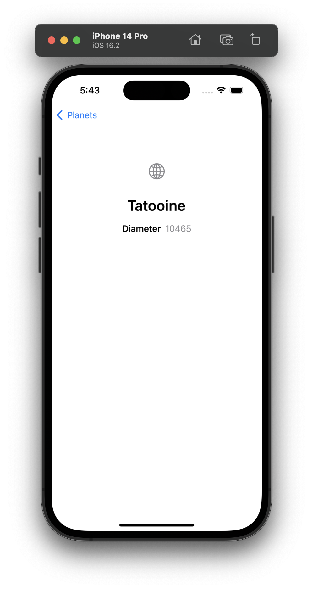

# Planets

## Table of contents
* [Introduction](#introduction)
* [Features](#features)
* [Software And Technologies](#software-and-technologies)
* [Setup](#setup)
* [Approach](#approach)
* [High Level Code Structure And Design Pattern](#high-level-code-structure-and-design-pattern)
* [Future Features And Improvements](#future-features-and-improvements)
* [Application Screens](#application-screens)

## Introduction:
iOS Application to show Planets List and Details, built with combination of Swift, SwiftUI, UIKit, CoreData.

## Features:
1.	Consume API (https://swapi.dev/api/planets/) to fetch the Planet records. (URL Session)
2.	Display the records in a List View. (SwiftUI)
3.	On click of each Planet, show details screen with few details of the selected Planet. (SwiftUI)
4.	Persist the Planet List and Details for Offline Viewing. (Core Data)
5.  Universal application.

## Software And Technologies:
* MacOS : Ventura (13.2.1)
* Xcode: 14.2
* Minimum iOS version: 15.0
* Swift: 5
* SwiftUI
* UIKit
* CoreData
* Combine

## Setup:
To run this project, open the Planets.xcodeproj in Xcode and you should be able to run it on the desired simulator without any changes(iPhone/iPad).
You will need to configure your development team in the app target's **"Signing & Capabilities"** tab in order to run it on real device.

## Approach:
1. When the app is first launched, use the **URL Session** data task to retrieve planet records from the planets API.
2.	Create the Json object from API response data using **JSONSerialization**.
3.	Save the object from Json data into **Core Data**.
4.	Use **SwiftUI** to show the List of Planets and its details.
5.	On each launch of the app, check if the data is available in offline storage, if yes fetch the data from offline and display, otherwise fetch the data from planet API.
6.	Show Errors using **Alert view** and Labels appropriately.
7.	**Protocols**: Used protocols for notifying the controller about planets data availability and errors.
8.	**Enum**: Used with **Tuple** cases **generic** type for Success and Failure conditions.
9.	**Extensions**: Used for adding more functionality to class and modularizing the code.

## High Level Code Structure And Design Pattern:
1.	**PlanetListView** – view responsible for displaying the List of planets.
3.	**PlanetDetailView** – view responsible for displaying the details of the selected Planet from planet list.
4.	**NetworkManager** - responsible for managing the network call to get the data from the planet API.
5.	**PlanetOfflineDataManager** – responsible for handling core data actions (fetch, add).

  

## Future Features And Improvements:
1.	**Load more** feature to fetch the next available records.
2.	Parse and show more details of the planet.
3.	**Pull to refresh** feature would be useful to refresh the data in the List.
4.	**Search** planet functionality.
5.	More Unit Tests.
6.  If app navigation becomes complex use UIKit

## Application Screens:
### 1.	Planet List screen:
  *	This is the landing page (Home Page) of the app, where the list of planets is shown. Each item in the list shows Name of the planet and its diameter. 
### 2.	Planet Details Screen :
  * This screen shows the details of the selected Planet.
  
  #### iPhone Screens
  

  
  
  

  
  #### iPad Screens
  ##### iPad - Portrait   
  

  
  
  

